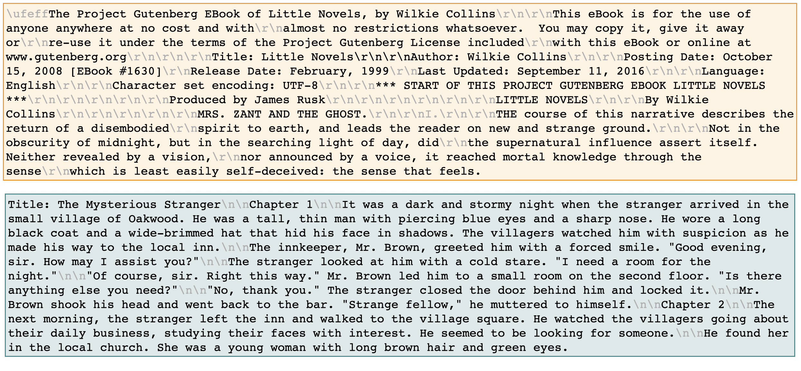

### Disclaimer
The forged novels were generated in March 2023. Hence, with the new gpt-3.5-api update, the generated novels may differ from those used here. Due to hight temperature value set to ensure the creativity of the resulting novel text, the response returned from the API will be different from the initial experiment setting.

Any extended applications of this research should adhere to established ethical guidelines, such as using the generated forged novels and the proposed model only for classification purposes and research objectives. Moreover, using the proposed model and dataset generation should refrain from distributing any author’s original content without appropriate consent.

# Forged-GAN-BERT: Authorship Attribution for LLM-Generated Forged Novels

Forged-GAN-BERT is a modified GAN- BERT-based model to improve the classification of forged novels in two data-augmentation aspects: via the Forged Novels Generator (i.e., ChatGPT) and the generator in GAN. Compared to other transformer-based models, the proposed Forged-GAN-BERT model demonstrates an improved performance with F1 scores of 0.97 and 0.71 for identifying forged novels in single-author and multi-author classification settings. Additionally, we explore different prompt categories for generating the forged novels to analyse the quality of the generated texts using different similarity distance mea- sures, including ROUGE-1, Jaccard Similarity, Overlap Confident, and Cosine Similarity.

This repository contains the code and data used for our [EACL SRW paper](https://aclanthology.org/2024.eacl-srw.26/). And the code is available at [GitHub Repository](https://github.com/Kaniz92/Forged-GAN-BERT).

## Dataset

*Fig.1: Original Novel (top) and Forged Novel (bottom) - Little Novels by Wilkie Collins.*

*Table 1: Prompt examples per each parameter type*

## Forged Novels Analysis

*Prompt Type Impact Calculation using Similarity Scores*

## Model Architecture

*Model Architecture*

## Results

*Comparison between ChatGPT and All Authors (Averaged) Binary Classifications using BERT Embedding as features*

*Comparison between ChatGPT vs Human Binary Classifications using BERT Embedding as features.*

## Research Paper

If you use these resources, please cite:

<b>Forged-GAN-BERT: Authorship Attribution for LLM-Generated Forged Novels</b>. Kanishka Silva, Ingo Frommholz, Burcu Can, Fred Blain, Raheem Sarwar, Laura Ugolini (2024).

    @inproceedings{silva-etal-2024-forged,
      title = "Forged-{GAN}-{BERT}: Authorship Attribution for {LLM}-Generated Forged Novels",
      author = "Silva, Kanishka and Frommholz, Ingo and Can, Burcu and Blain, Fred and Sarwar, Raheem and Ugolini, Laura",
      editor = "Falk, Neele and Papi, Sara and Zhang, Mike",
      booktitle = "Proceedings of the 18th Conference of the European Chapter of the Association for Computational Linguistics: Student Research Workshop",
      month = mar,
      year = "2024",
      address = "St. Julian{'}s, Malta",
      publisher = "Association for Computational Linguistics",
      url = "https://aclanthology.org/2024.eacl-srw.26",
      pages = "325--337"}

